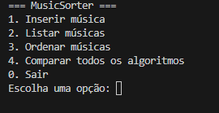
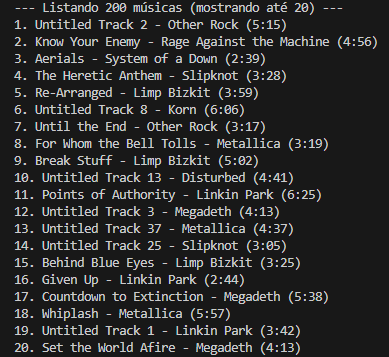

# MusicSorter – Sistema de Ordenação de Músicas

## Aluno

| Matrícula | Nome |
| --- | --- |
| 202017521 | Algusto Rodrigues Caldas |

* * *

## Descrição do Projeto

O **MusicSorter** é um projeto desenvolvido para demonstrar o funcionamento de **algoritmos de ordenação clássicos** — *Bubble Sort*, *Insertion Sort* e *Quick Sort* — aplicados em uma base de músicas.

Cada música possui os seguintes atributos:

* **Título**
* **Artista**
* **Duração (mm:ss)**

O usuário pode escolher o algoritmo e o critério de ordenação (título, artista ou duração), além de visualizar o **tempo de execução** e o **número de comparações** realizados por cada método.

* * *

## Funcionalidades Principais

* Inserir novas músicas na base.
* Listar todas as músicas cadastradas.
* Ordenar por **título**, **artista** ou **duração**.
* Escolher o algoritmo de ordenação:
  * Bubble Sort
  * Insertion Sort
  * Quick Sort
* Comparar o **tempo de execução** e o **desempenho** entre os algoritmos.

* * *

## Conceitos de Estrutura de Dados Aplicados

* Estruturas de dados lineares: **listas e dicionários**.
* Implementação manual de algoritmos clássicos de ordenação.
* Análise empírica de desempenho e contagem de comparações.
* Medição de tempo de execução com `time.perf_counter()`.
* Modularização de código em Python.

* * *

## Guia de Instalação

### Dependências do Projeto

* Linguagem: **Python 3.10+**
* Nenhuma biblioteca externa é necessária.

### Como Executar o Projeto

1. Clone o repositório:
  
      git clone https://github.com/EDAII/Ordenacao_MusicSorter.git
  
2. Acesse a pasta do projeto:
  
      cd Ordenacao_MusicSorter
  
3. Execute o programa:
  
      python main.py
  

* * *

## Capturas de Tela

### Apresentação

### Aplicação em Execução

#### Tela do Menu

#### Lista de Músicas

#### Ordenação das Músicas

* * *

## Exemplo de Execução

    === MusicSorter ===
    1. Inserir música
    2. Listar músicas
    3. Ordenar músicas
    4. Comparar todos os algoritmos
    0. Sair
    Escolha uma opção: 3
    
    Escolha o critério:
    1. Título
    2. Artista
    3. Duração
    Critério: 2
    
    Escolha o algoritmo:
    1. Bubble Sort
    2. Insertion Sort
    3. Quick Sort
    Algoritmo: 3
    
    Ordenação concluída em 0.00031 segundos (comparações: 45)

* * *

## Objetivos de Aprendizado

* Compreender o funcionamento de diferentes algoritmos de ordenação.
* Aplicar conceitos de **complexidade de tempo**.
* Comparar empiricamente o desempenho entre métodos distintos.
* Desenvolver **raciocínio lógico** e **modularização** em Python.

* * *

## Conclusões

* O projeto permitiu observar, na prática, o **impacto da complexidade** de cada algoritmo no tempo de execução.
* O **Quick Sort** apresentou o melhor desempenho médio, seguido pelo **Insertion Sort**, enquanto o **Bubble Sort** foi o mais lento.
* A comparação empírica reforça a importância da escolha adequada do algoritmo conforme o tamanho da base de dados.

* * *